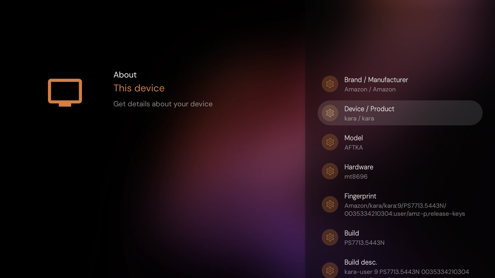

# Fire TV 4K Max 1st Gen (`kara`) standalone toolkit

This toolkit converts one exact Fire TV build to a Projectivy-based setup. The
`apply` command downloads and authenticates the complete kara exploit, obtains
temporary root, contains a staged OTA, installs Projectivy Launcher and Aurora
Store, installs and selects LeanKey Keyboard for reliable TV-remote text entry,
installs the included Kara Settings repair, switches HOME, and removes the
reviewed non-core Amazon packages for Android user 0. It deliberately keeps
the smallest verified stock support set needed for Fire TV display, audio,
network, app-management, controller, device, and accessibility settings.

It does not unlock the bootloader, flash a ROM, write a partition, or install
persistent root.

> **NO HARDWARE SHORTING NEEDED.** The supported build is handled entirely
> through authorized ADB and the published software exploit. Do not open the
> Stick, bridge test points, or short eMMC pins for this procedure.

## Live device screenshot



Captured after opening Projectivy System → About → **This device** on the
supported physical `kara/AFTKA` target on 2026-09-11. The exact identity audit,
authenticated non-live exploit probe, and durable configuration verification
passed. See [`docs/TEST-EVIDENCE.md`](docs/TEST-EVIDENCE.md) for the precise
boundary of what was tested and the fingerprint/build-number clarification.

## Exact supported device

Every value below must match. Mutating commands stop on any mismatch.

| Property | Required value |
| --- | --- |
| Product codename | `kara` |
| Amazon model | `AFTKA` |
| Marketing model | Fire TV Stick 4K Max 1st Generation (2021) |
| Fire OS base | Android 9 / API 28 |
| Firmware build | `0035334210436` (`PS7713/5443`) |
| Kernel | `4.14.87+`, ARM32 `armv7l`, four online CPUs |
| SoC | MediaTek MT8696 |

This is not compatible with `mantis/AFTMM`, `mantra/AFTKM`, or
`karat/AFTKRT`, even though their names or hardware may look similar.

The normal `apply`, `backup`, and `verify` commands remain locked to the exact
build above. They never treat a newer firmware as proven compatible.

## Carefully test a newer firmware

Newer builds can be tested without weakening `apply`. First run `audit` and
copy the exact 13-digit `BUILD` value. The experimental path still requires
`kara/AFTKA`, API 28, kernel `4.14.87+`, ARM32 `armv7l`, four CPUs, uid 2000,
and enforcing SELinux. Only the build number may differ, and it must be
strictly newer than `0035334210436`.

Start with the safe probe. It authenticates the separate experimental release,
backs up state, temporarily enables the CEC reboot guard, and runs only the
exploit's non-live compatibility checks:

```sh
./scripts/kara-tool.sh \
  --serial FIRE_TV_IP:5555 \
  --newer-build YOUR_13_DIGIT_BUILD \
  --yes probe-newer
```

Success prints `EXPERIMENTAL_NEWER_PROBE=PASS`. This does not attempt root,
install apps, switch HOME, remove packages, or change OTA policy.

Only after that passes, make one live attempt:

```sh
./scripts/kara-tool.sh \
  --serial FIRE_TV_IP:5555 \
  --newer-build YOUR_13_DIGIT_BUILD \
  --accept-watchdog-reboot \
  --yes test-newer
```

This command runs the safe probe first and then starts live mode exactly once.
It can hang, disconnect ADB, or watchdog-reboot the Stick. On success it proves
temporary uid 0 and prints `EXPERIMENTAL_NEWER_ROOT=PASS`; it deliberately does
not install, debloat, switch launchers, or touch OTA state. Reboot afterward to
remove temporary root. A successful result is evidence only for that exact
build and does not make normal `apply` accept it.

## Read this before `apply`

**The exploit can reboot the Stick.** It uses a live kernel race. A failed
attempt can trigger the watchdog, disconnect ADB, and leave temporary root
unavailable. If the screen says an update will install on the next reboot,
disconnect the Stick from uncontrolled networks and read
[`docs/RECOVERY.md`](docs/RECOVERY.md) first.

`apply` creates a local backup before invoking live mode and refuses package
changes until uid 0 is proven. If ADB remains available, later failures trigger
a best-effort automatic rollback. A watchdog reboot can prevent that automatic
rollback, so keep the printed backup directory.

**Root is temporary.** It disappears on reboot. Projectivy as HOME, installed
apps, and user-0 package removals are Android package-manager state and normally
survive a reboot. The system APKs remain on the read-only system partition and
can be restored.

## Requirements

On the controller computer:

- POSIX shell, Python 3, `curl`, and `shasum` or `sha256sum`;
- Android platform tools (`adb`);
- Android SDK build tools (`aapt` and `apksigner`);
- ADB debugging enabled and authorized on the Fire TV;
- for USB bridge mode, key-based SSH plus `scp` and `adb` on the Linux host.

On macOS, install ADB with:

```sh
brew install android-platform-tools
```

If Android build tools are not on `PATH`, set their exact locations:

```sh
export AAPT="$ANDROID_SDK_ROOT/build-tools/35.0.0/aapt"
export APKSIGNER="$ANDROID_SDK_ROOT/build-tools/35.0.0/apksigner"
```

## Wi-Fi ADB quick start

Replace `FIRE_TV_IP` with the Stick's address. Accept the debugging prompt on
the TV before continuing.

```sh
adb connect FIRE_TV_IP:5555
./scripts/kara-tool.sh --serial FIRE_TV_IP:5555 audit
./scripts/kara-tool.sh --serial FIRE_TV_IP:5555 --yes apply
./scripts/kara-tool.sh --serial FIRE_TV_IP:5555 verify
```

The `audit` output must say both `SUPPORTED_MUTATION_TARGET=YES` and
`SUPPORTED_EXPLOIT_TARGET=YES`. During `apply`,
the important success markers are:

```text
TEMP_ROOT=PASS
STAGED_OTA_PATHS=ABSENT
STOCK_SETTINGS_SUPPORT=PASS
PROJECTIVY_HOME_GATE=PASS
PRIVILEGED_REMOVAL=PASS
PARENTAL_CONTROLS_REMOVAL=PASS
ADB_ENABLED=1
VERIFY_GATE=PASS
APPLY_GATE=PASS
```

## USB through a Linux host

Connect the Stick by USB to a Linux host where `adb devices` lists it as
authorized. From the controller computer, replace `LINUX_HOST` and
`USB_SERIAL`:

```sh
./scripts/kara-tool.sh \
  --bridge root@LINUX_HOST \
  --serial USB_SERIAL \
  audit

./scripts/kara-tool.sh \
  --bridge root@LINUX_HOST \
  --serial USB_SERIAL \
  --yes apply

./scripts/kara-tool.sh \
  --bridge root@LINUX_HOST \
  --serial USB_SERIAL \
  verify
```

Downloads are authenticated on the controller, copied to a randomized `/tmp`
path on the Linux host, passed to its ADB, and removed from the host afterward.

## Install only the TV keyboard

If Projectivy and Aurora Store are already installed, repair text entry without
running the exploit or changing HOME, OTA, or Amazon packages:

```sh
./scripts/kara-tool.sh --serial FIRE_TV_IP:5555 --yes install-keyboard
```

The command accepts only the exact supported `kara/AFTKA` build, downloads and
authenticates the pinned LeanKey APK, preserves Amazon FireTVIME, records the
current default IME, installs LeanKey, enables it, selects it, and reads the
setting back. If activation fails, it restores the previous IME and removes
LeanKey when LeanKey was not already installed. Manual rollback is:

```sh
adb -s FIRE_TV_IP:5555 shell ime enable com.amazon.tv.ime/.FireTVIME
adb -s FIRE_TV_IP:5555 shell ime set com.amazon.tv.ime/.FireTVIME
```

## What `apply` does

The order is fail-closed:

1. Verify the exact device, model, build, API, kernel, ABI, CPU count, shell
   uid, and enforcing SELinux state. A supplied exact-path root helper may
   resume from permissive SELinux only after its uid-0 proof is verified.
2. Record HOME, default input method, package inventories, firmware identity,
   OTA preference, CEC guard, and boot ID in a timestamped local backup.
3. Download the exact exploit release and require its tag, filename, GitHub
   URL, release digest, and independently pinned live-tested SHA-256.
4. Stage it at a per-run device path, enable the CEC reboot guard, and run its
   non-mutating `--probe`.
5. Reuse an exactly matched live daemon or invoke live mode once; require uid 0,
   the root proof, exact daemon executable path, and unchanged firmware.
6. Resolve only the known empty-directory OTA collision with `rmdir`, then
   require the staged OTA directory and both recovery command paths to be absent.
7. Download and authenticate Projectivy, Aurora Store, and the pinned LeanKey
   Keyboard; install them and Kara Settings; select and read back LeanKey as the
   default IME; then re-register and enable the exact stock packages required by
   the Fire TV settings bridge.
8. Direct-start Projectivy, root-disable only Amazon launcher's HOME activity
   plus Fire Home Starter, set and read back Projectivy as HOME, and remove Fire
   Home Starter. The Amazon launcher package remains installed as a privileged
   bridge to the complete stock Settings menu, but it can no longer become HOME.
   If a HOME command fails, its package-manager output is printed before
   rollback so the underlying permission or resolver error is visible.
9. Remove the remaining reviewed Amazon packages for user 0. Any package that
   an ordinary shell uninstall leaves active is retried through the proven root
   helper, and the full removal manifest is read back.
10. Set the OTA preference, release only the exact Amazon parental-controls
    profile owner with hash-pinned helpers, remove parental controls last, and
    verify HOME, ADB, OTA, apps, LeanKey, removals, and the stock settings bridge.

`--root-helper /data/local/tmp/NAME` remains available for advanced recovery.
It bypasses exploit launch only after providing the same uid-0, build, and exact
daemon-executable proof. This resume path never starts another exploit attempt;
keep the Stick powered until `apply` finishes. See
[`docs/RECOVERY.md`](docs/RECOVERY.md) for the exact command and OTA safeguards.
If an older checkout reports that Amazon's launcher remained HOME, leave the
root daemon running, update the repository, and rerun this same resume command.

### Trace package-removal behavior

`--trace-removals` is an opt-in diagnostic for `apply`, not a dry run. It adds
package-state reads before removal, after each ordinary and root removal
attempt, and at the final removal gate. Each `REMOVAL_TRACE` line contains a
controller UTC timestamp, the phase and package just processed, and ADEP's
user-0 state. ADEP is now intentionally preserved because it is part of the
verified stock Settings dependency chain, so a normal run should show it
remaining `ACTIVE` throughout. This option remains useful for comparing older
profiles and diagnosing unexpected package-manager transitions.

Use this only with the exact supported build and the usual backup and rollback
precautions. It still performs the full mutating `apply` and makes extra ADB
reads; it does not retry or change removal decisions. For an existing verified
root daemon, replace `HELPER_NAME` with its exact device path:

```sh
./scripts/kara-tool.sh \
  --serial FIRE_TV_IP:5555 \
  --root-helper /data/local/tmp/HELPER_NAME \
  --trace-removals \
  --yes apply > kara-apply-trace.log 2>&1
```

Keep the printed `BACKUP_DIR`, and inspect the complete log for
`AUTOMATIC_ROLLBACK=PASS` if `apply` fails. Do not assume rollback succeeded
merely because a trace line was printed.

## Restore the backup

`apply` prints `BACKUP_DIR=/path/to/directory`. To restore that state, keep the
same connection options and pass the absolute directory:

```sh
./scripts/kara-tool.sh \
  --serial FIRE_TV_IP:5555 \
  --root-helper /data/local/tmp/kara-ghostlock-NUMBER \
  --backup /absolute/path/to/backups/TIMESTAMP-PID \
  --yes restore
```

For a USB bridge, add `--bridge root@LINUX_HOST --serial USB_SERIAL`. Restore
reinstalls only packages that were present in that backup and restores their
disabled state, Amazon launcher HOME-component state, HOME, OTA preference, and
CEC guard, then reads all of that state back before reporting success. Current
profiles retain `com.amazon.tv.launcher`; restore still supports older backups
where it was removed. A protected Fire OS HOME package is registered for user 0
through the ordinary ADB shell context, then the still-live verified root helper
restores its protected enabled state and HOME selection. HOME packages are
handled after every other manifest package so later Fire OS activity cannot
revert them to `installed=false`. If the backed-up launcher activity is no
longer eligible as HOME, the verified Fire OS equivalent
`com.amazon.firehomestarter/.HomeStarterActivity` is accepted. Rootless restore
is refused. If the daemon was lost to a reboot, obtain a fresh exact-build
temporary root before restoring. Restore does not flash firmware.

If `apply` must release the exact Amazon parental-controls profile owner, it
copies `profile_owner.xml`, `device_policies.xml`, and a policy dump into the
backup first. Those files are forensic/manual recovery material: `restore`
does not silently recreate Android device-policy ownership. The release is
therefore the final one-way policy mutation, after every other removal and the
OTA preference have passed.

## Complete exploit source

The complete kara adaptation is public in the provenance-preserving
[`Delitants/GhostLock` kara branch](https://github.com/Delitants/GhostLock/tree/kara-PS7713-5443/kara).
Its host tests, build script, target constants, source provenance, and release
notes are included there. The controller pins release
[`kara-PS7713-5443-v1`](https://github.com/Delitants/GhostLock/releases/tag/kara-PS7713-5443-v1)
and SHA-256:

```text
a42185d743ee1d4c9c46c1e35f5fa0a40f5e9a7f81450308c3eab297677847d5
```

The isolated, unvalidated newer-build source is on the
[`feat/experimental-newer-firmware` branch](https://github.com/Delitants/GhostLock/tree/feat/experimental-newer-firmware/kara).
The controller authenticates its separate
[`kara-experimental-newer-v1` release](https://github.com/Delitants/GhostLock/releases/tag/kara-experimental-newer-v1)
and pinned SHA-256:

```text
d0978d3fcc938150cdc8992243b7a70eedc285ac833ff7a20e99e7b49610a8be
```

## Application supply-chain checks

Projectivy is downloaded from the developer's
[`spocky/miproja1`](https://github.com/spocky/miproja1/releases/latest)
releases. The script verifies the official URL, GitHub digest, package name,
version, API compatibility, and signing certificate.

Aurora Store is downloaded from AuroraOSS's official catalog. The script
requires the standard APK under `/downloads/AuroraStore/Release/` and verifies
its URL, package name, version, API compatibility, and signing certificate.

LeanKey Keyboard is downloaded from the developer's
[`yuliskov/LeanKeyboard`](https://github.com/yuliskov/LeanKeyboard/releases/tag/6.1.31)
release. Because the upstream release does not publish an asset digest and its
legacy developer certificate uses an old SHA1/DSA key, this toolkit permits
only the device-tested 6.1.31 asset and requires its exact filename, trusted
GitHub URL, package, version, Android compatibility, APK SHA-256
`5a90529fcae55c664128fb36e752f90e84d158266eced85084594c1d336a1468`,
and certificate SHA-256
`955ef7b51f8fb9e4036678471a9edea0bbb3bb9b02753f796d9d6bf19dc2002d`.
Amazon FireTVIME remains installed for rollback.

No third-party APK is stored in this repository. No other app store or updater
is installed by this toolkit.

## Stock settings and Kara Settings

Display and audio settings are not reimplemented. Fire OS protects those
panels with a signature-level permission, so `com.amazon.tv.launcher` is kept
as a non-HOME privileged bridge to the stock Settings menu. The profile also
preserves its verified dependencies plus Amazon Home Theater audio settings,
the Fire TV screensaver service/settings, wireless home-audio settings, AV-sync,
resolution, HDMI/device-control, network, Bluetooth, and input services.

The included open-source `local.kara.settingsredirector` presents that full
stock menu as **Fire TV Settings (Display & Sounds + more)** and also provides
independent TV-oriented Network, Applications, Developer & ADB, Controllers &
Bluetooth, and Device & About fallbacks. The ADB page is intentionally
read-only; `apply` refuses success if `adb_enabled` is not still `1`. Source,
build notes, and the reviewed APK hash are under
[`app/kara-settings/`](app/kara-settings/).

## Commands and tests

```text
audit                  Read-only identity and launcher inventory
download-projectivy    Authenticate and cache Projectivy
download-aurora        Authenticate and cache Aurora Store
download-keyboard      Authenticate and cache pinned LeanKey Keyboard
download-exploit       Authenticate and cache the exact kara exploit
download-experimental  Authenticate and cache the unvalidated newer-build exploit
probe-newer            Run only safe compatibility checks on an exact newer build
test-newer             Make one acknowledged live root attempt on that build
backup                 Save restorable user-0 state
install-keyboard       Install/select LeanKey without exploit or debloat
apply                  Run the complete backed-up workflow
verify                 Verify the durable configuration
restore                Restore a named backup
```

The offline suite uses fake ADB, SSH, and download endpoints and never touches
a real device:

```sh
sh tests/run-tests.sh
python3 tests/verify-manifests.py
```

See [`docs/MODEL-SAFETY.md`](docs/MODEL-SAFETY.md),
[`docs/RECOVERY.md`](docs/RECOVERY.md), and [`NOTICE.md`](NOTICE.md).
